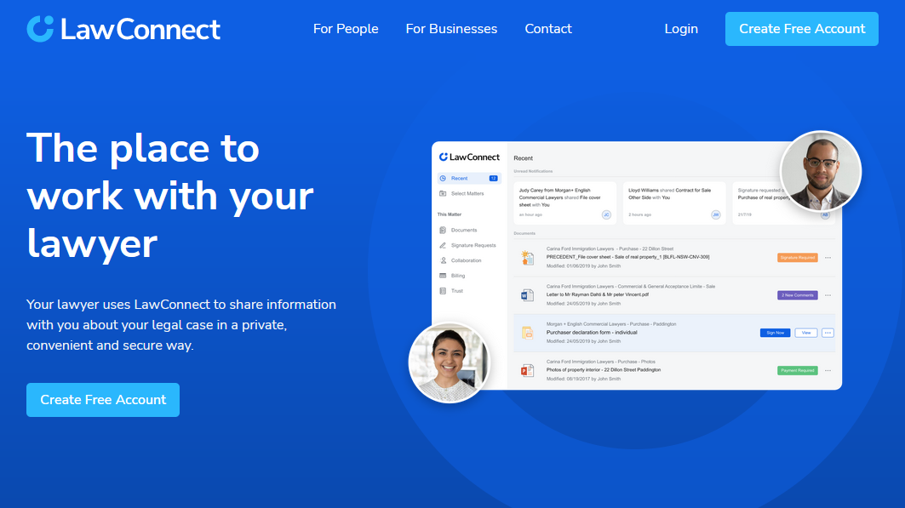

# LawConnect Landing Page Exercise

## [Find this project hosted here](https://codesandbox.io/p/github/kchndesign/lawconnect-landing-page/main)

This is a mock landing page that uses create-react-app with the typescript
template. It was built to demonstrate my ability to recreate an Adobe XD mockup
as well as my current knowledge in front end development. This was a task given
to me during the recruitment process for a junior front end web developer
position.

## Contents

-   ## [Project Brief](#project-brief-1)
-   ## [Implementation Notes](#implementation-notes-1)
-   ## [Project Reflection](#project-reflection-1)

## Project Brief

### Aims

The aims of the project are to demonstrate my knowledge in the following:

-   React
-   Typescript
-   SASS/SCSS

### Requirements

-   Create a page referencing the provided design files, trying to match it as
    closely as possible.
-   Avoid using UI kits or CSS libraries/frameworks.
-   Free to use vanilla JS or a modern framework of your choice.
-   Avoid libraries for simple tasks.

## Implementation Notes

### Component Architecture Philosophy

Upon completing this project, there were only 3 'reusable' components:

-   A navbar component that took no props
-   An action button component
-   A card component

Most of the markup for the landing page was contained in a `LandingPage` file.
The rationale here is that since the page is unlikely to change dynamically and
features little interaction or data fetching, there was no reason to
over-engineer a solution that would split the page further into sub components.

The navbar was encapsulated into a component for two reasons. The first was that
on a production website, the nav bar would most obviously be used more than a
few times. The second was that, since I was to create a hamburger menu
implementation by hand, I would need to manage the toggle state of the dropdown
menu.

The action buttons and cards were obvious candidates to be extracted into
components because they were used more than once on the page. They didn't have
any state, so were just presentational components.

### Scoped vs Unscoped CSS

This project uses a mixture of scss modules and regular scss. The main reason
was that I started the project using modules then changed halfway through. I
consider scoped css in create-react-app, while useful, is probably overkill for
a project this size.

In the end, I settled on having scoped css for the components, and regular css
for the landing page layout. The reason for this was pretty arbitrary, but it
made sense somehow to encapsulate the css like you would encapsulate state or
data in a component.

### UI Changes

Other than changing some typos in the design document, here are the intentional
changes I have made to the design for my implementation.

**Navbar Background Colour**

In the design, the sticky nav bar had no background colour. Hence the white link
text would get lost on the page. I changed the background colour to a frosted
'vivid blue' colour so that the text was always visible no matter what colour
the page was in the background. I chose to do a frosted look because the actual
LawConnect site has that effect.

**Navbar hamburger menu**

I chose to add a hand-built dropdown menu corresponding to the hamburger icon in
the design document just because I thought the page would feel incomplete
without it. My implementation approach wasn't the most ideal, however. It used a
separate `ul` of links for the dropdown menu, because I wanted to preserve the
simple flex styling for the desktop version of the navbar.

**Create free account button hover effect**

In the XD document, the hover effect for the 'Create free account' buttons would
change both the size and background colour of the button. In my implementation,
only the background colour changed. I assumed that the change in size was a
mistake because it would create an unpleasant oscillating effect.

## Project reflection

### Messy styling

Upon completing the landing page, some of the styling for the page ended up
quite messy. If I were to spend more time on the project, I would endeavour to
clean up that stylesheet so it's easier to read. Maybe even breaking out the
nested styling into more defined sections.

### Hamburger Menu implementation

The way I did the dropdown menu probably wasn't the best, especially from an
accessibility point of view. Although, I think there are better off-the-shelf
solutions that would have cost less time.

### Tooling

While I mostly chose to use create-react-app to brush-up on my React skills, I
recognise that the project is very bloated with all of the packages that
create-react-app has included.
